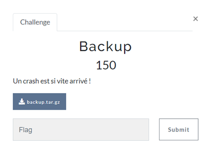
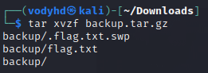
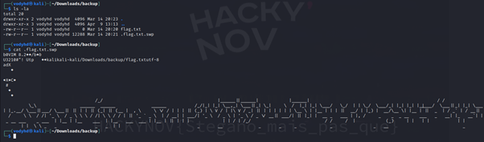
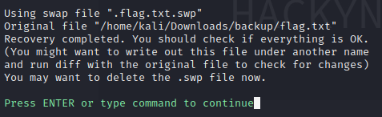

# BACKUP

| Nom du challenge  | Catégorie     | Nombre de points | Nombre de résolution |
|-------------------|---------------|------------------|----------------------|
| Backup            | Système       |        150       |         11/11        |



On commence par ouvrir l’archive avec la commande :
```
tar xvzf backup.tar.gz
```



On peut directement voir que nous avons 2 fichiers intéressants :
- flag.txt
- .flag.txt.swp

On commence par regarder le contenu de *flag.txt* : le fichier est vide

Passons à *.flag.txt.swp*



C’est déjà plus intéressant mais malheureusement c’est illisible.<br/>
Après quelques recherches on apprend que les fichiers swp avec vim sont des fichiers de backup. Afin de pouvoir les ouvrir et récupérer les données sauvegardées, il faut utiliser l’option -r.
```
vim -r .flag.txt.swp
```



Voilà qui est plus intéressant !

Après avoir recover le fichier .flag.txt.swp on obtient le contenu du fichier en clair !


FLAG : **HACKYNOV{v1m_is_the_best}**