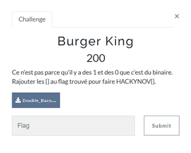
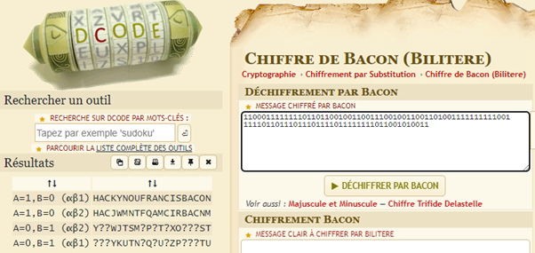

# BURGER KING

| Nom du challenge  | Catégorie     | Nombre de points | Nombre de résolution |
|-------------------|---------------|------------------|----------------------|
| Burger King       | Cryptanalyse  |        200       |         9/11         |

La description nous aide mais nous n’en dit pas énormément. On se retrouve avec une suite de 0 et de 1 mais ça n’est pas du binaire.

Après quelques recherches à l’aide des indices que l’on a avec le nom du challenge ainsi que le nom de notre fichier texte, on trouve le chiffrement Bacon Bilitère (alphabet seulement composé de 2 lettres).

Decodeur online : https://www.dcode.fr/chiffre-bacon-bilitere 

lettre 1 : 0
letter 2 : 1

FLAG : **HACKYNOV{FrancisBacon}**