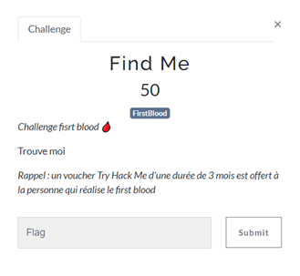
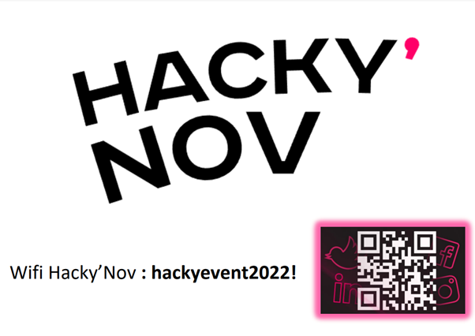
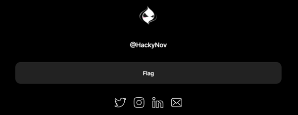
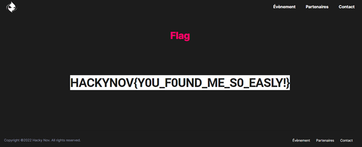
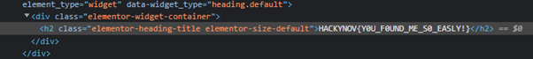

# FIND ME

| Nom du challenge  | Catégorie     | Nombre de points | Nombre de résolution |
|-------------------|---------------|------------------|----------------------|
| Find Me           | First Blood   |        50        |         3/11         |

Il fallait donc le trouver.

Dès le début de l’événement le flag était visible par tout le monde grâce au QRcode présent sur notre kakemono (rollup). 
Nous avions dispersé des affiches rappelant le code du WifI. Nous y avons également mis un QRcode, très différent de celui du kakemono.

Ce QRcode était celui du kakemono, il permettait d’accéder au Linktree de Hacky’Nov.

Ce Linktree comprenait un lien vers le Flag : https://hackynov.fr/flag 

Le flag était écrit dans la même couleur que le background de notre site. 
Il était donc possible de surligner le texte avec la souris ou directement en inspectant l’élément.

FLAG : **HACKYNOV{Y0U_F0UND_ME_S0_EASLY!}**