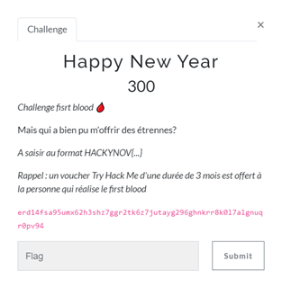
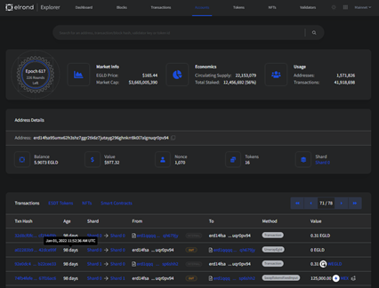
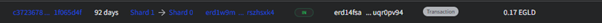
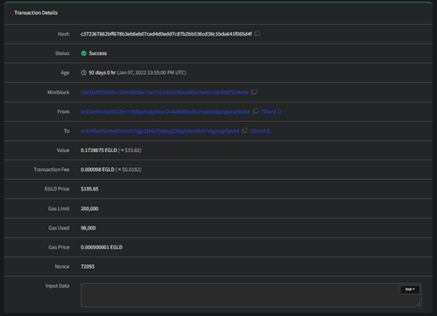

# HAPPY NEW YEAR

| Nom du challenge  | Catégorie     | Nombre de points | Nombre de résolution |
|-------------------|---------------|------------------|----------------------|
| Happy New Year    | First Blood   |        300       |         2/11         |

Ce challenge se résumait à beaucoup de compréhension écrite mais aussi un peu de recherche. 
On a plusieurs informations, quelqu’un nous a donné des étrennes et le flag correspond à cette personne. 
Dans un premier temps quelle est la définition exacte des étrennes ?  
Les étrennes sont des cadeaux offerts obligatoirement en début d'année, au début du mois de janvier (Wikipédia).

Dans un second temps, quelle est cette chaine de caractères ?  
> erd14fsa95umx62h3shz7ggr2tk6z7jutayg296ghnkrr8k0l7algnuqr0pv94

Si l’on fait attention au libellé du challenge, on voit « cryptocurency ». Ce qui nous met sur la voie.

Est-ce une adresse ? Un smart-contract ? Sur quelle Blockchain ? 
Il faut savoir que les premiers caractères de chaque adresse, que ce soit un wallet ou un smart-contract, définissent en général le réseau d’appartenance à celle-ci. 
Ici, après une petite recherche on voit que « erd » correspond à la blockchain Elrond.

Le but est maintenant de chercher l’historique des transactions afin de trouver notre expéditeur secret. 
Pour ce faire, [l’Explorer Elrond](https://explorer.elrond.com/) est un outil développé par les développeurs de cette Blockchain est très bien pour regarder l’historique d’un wallet.

Il suffit de copier l’adresse dans la barre de recherche. Une fois fait, on accède à l’historique d’un compte. 
Il suffit donc d’accéder aux transactions réalisées et reçues en début d’année.

Maintenant on cherche une éventuelle transaction entrante (In).

La première transaction entrante, nous offrant des étrennes a été envoyée par l’adresse : 
> erd1w9mmxz6533m7cf08gehs8phkun2x4e8689ecfk3makk3dgzsgurszhsxk4

Une autre transaction a eu lieu le 1er janvier nous offrant un NFT. C’était une autre solution à ce challenge étant donné que c’est la même adresse émettrice.

FLAG : **HACKYNOV{erd1w9mmxz6533m7cf08gehs8phkun2x4e8689ecfk3makk3dgzsgurszhsxk4}**