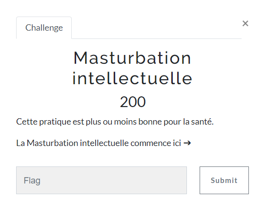
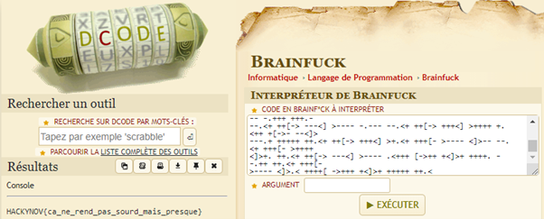

# MASTURBATION INTELLECTUELLE

| Nom du challenge            | Catégorie     | Nombre de points | Nombre de résolution |
|-----------------------------|---------------|------------------|----------------------|
| Masturbation intellectuelle | First Blood   |        200       |         8/11         |

Le premier défi était de comprendre le challenge et d'avoir toutes les informations utiles. 
Une chaîne de caractères se cache dans la description du challenge grâce à des balises HTML (style="display:none;")

> KysrKysgKysrWy0gPisrKysgKysrKzwgXT4rKysgKysrKysgLi0tLS0gLS0tLisgKy4rKysgKysrKysgLjwrKysgWy0+KysKKzxdPisgKysrKy4gPCsrK1sgLT4tLS0gPF0+LS0gLisuKysgKysrKysgLjwrKysgKysrWy0gPisrKysgKys8XT4gKy48KysKKytbLT4gLS0tLTwgXT4tLS0gLS0tLS0gLi0tLi0gLS48KysgK1stPisgKys8XT4gKysrKysgKy4tLS0gLS0tLS0gLS4tLS0KLS0tLjwgKysrK1sgLT4rKysgKzxdPisgKysuPCsgKytbLT4gLS0tPF0gPi0tLS0gLisrKysgKysrKysgLjwrKysgWy0+LS0KLTxdPi0gLi0tLS0gLS48KysgKytbLT4gKysrKzwgXT4rLjwgKysrWy0gPi0tLTwgXT4tLS0gLS0tLjwgKysrK1sgLT4rKysKKzxdPisgKy48KysgKytbLT4gLS0tLTwgXT4tLS0gLS48KysgKytbLT4gKysrKzwgXT4rKysgKy4tLS0gLS4rKysgKysrLi0KLS0uPCsgKytbLT4gLS0tPF0gPi0tLS0gLS4tLS0gLS0uPCsgKytbLT4gKysrPF0gPisrKysgKy48KysgK1stPi0gLS08XT4KLS0tLisgKysrKysgKysuPCsgKytbLT4gKysrPF0gPisuPCsgKysrWy0gPi0tLS0gPF0+LS0gLS0uPCsgKysrWy0gPisrKysKPF0+Ky4gKysuPCsgKytbLT4gLS0tPF0gPi0tLS0gLjwrKysgWy0+KysgKzxdPisgKysrKy4gLS0uKysgKysuPCsgKysrWy0KPi0tLS0gPF0+LjwgKysrK1sgLT4rKysgKzxdPisgKysrKysgKysuPA==

On voit de suite que c'est chiffré en Base 64. 
Un fois décodé, on obtient une chaîne de caractères plus ou moins compréhensible (c'est le cas de le dire)

> +++++ +++[- >++++ ++++< ]>+++ +++++ .---- ---.+ +.+++ +++++ .<+++ [->++
> +<]>+ ++++. <+++[ ->--- <]>-- .+.++ +++++ .<+++ +++[- >++++ ++<]> +.<++
> ++[-> ----< ]>--- ----- .--.- -.<++ +[->+ ++<]> +++++ +.--- ----- -.---
> ---.< ++++[ ->+++ +<]>+ ++.<+ ++[-> ---<] >---- .++++ +++++ .<+++ [->--
> -<]>- .---- -.<++ ++[-> ++++< ]>+.< +++[- >---< ]>--- ---.< ++++[ ->+++
> +<]>+ +.<++ ++[-> ----< ]>--- -.<++ ++[-> ++++< ]>+++ +.--- -.+++ +++.-
> --.<+ ++[-> ---<] >---- -.--- --.<+ ++[-> +++<] >++++ +.<++ +[->- --<]>
> ---.+ +++++ ++.<+ ++[-> +++<] >+.<+ +++[- >---- <]>-- --.<+ +++[- >++++
> <]>+. ++.<+ ++[-> ---<] >---- .<+++ [->++ +<]>+ ++++. --.++ ++.<+ +++[->---- <]>.< ++++[ ->+++ +<]>+ +++++ ++.<

Après quelques recherches, on comprend que c'est un langage de programmation. 
L'un de ces avantages est la taille réduite de son compilateur.

Décodeur Online : https://www.dcode.fr/langage-brainfuck

Ce n'est pas réellement une fonction de déchiffrement mais un compilateur qui va exécuter le code. 
Une fois exécuté, le programme affiche donc le flag.

FLAG : **HACKYNOV{ca_ne_rend_pas_sourd_mais_presque}**