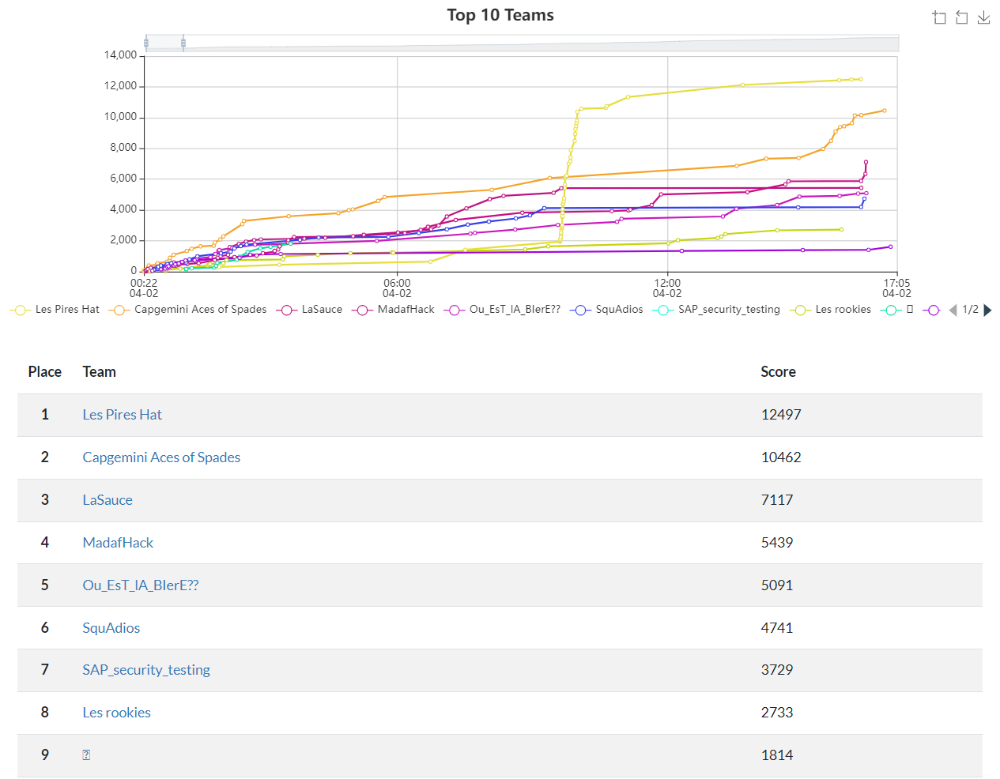

# HACKY'NOV

Challenges réalisés dans le cadre de la première édition du CTF Hacky'Nov à Aix-En-provence le 1er et 2 avril 2022.

## Scoreboard

## Challenges WU
| Nom du challenge            | Catégorie     | Nombre de points | Nombre de résolution |
|-----------------------------|---------------|------------------|----------------------|
| [Backup](/Backup/)                      | Système       |        150       |         11/11        |
| [Burger King](/Burger_King/)                 | Cryptanalyse  |        200       |         9/11         |
| [Find Me](/Find_Me/)                     | First Blood   |        50        |         3/11         |
| [Happy New Year](/Happy_New_Year/)              | First Blood   |        300       |         2/11         |
| [Masturbation intellectuelle](/Masturbation_intellectuelle) | First Blood   |        200       |         8/11         |
| [Reveasy](/Reveasy/)                     | Reverse       |        50        |         9/11         |
| [Robuste (apparemment)](/Robuste/)       | Cryptanalyse  |        150       |         6/11         |
| [Zipette](/Zipette/)                     | Miscellaneous |        600       |         1/11         |

## Contact

Pseudo : VodyHD 
Pro : [Thomas QUERNEC](https://linkedin.com/in/thomas-quernec)
