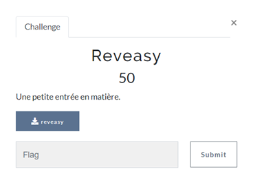
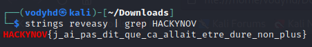

# REVEASY

| Nom du challenge | Catégorie     | Nombre de points | Nombre de résolution |
|------------------|---------------|------------------|----------------------|
| Reveasy          | Reverse       |        50        |         9/11         |



Ce premier challenge de reverse était simple mais c’est un incontournable.<br/>
Il est indispensable de commencer un challenge de reverse avec un petit Strings afin d’avoir une vision globale des variables, fonctions, return, etc.

Ici, la commande Strings vous donnez directement le flag étant donné qu’il était en clair dans le programme.
```
strings reveasy | grep HACKYNOV{
```



On peut rajouter un grep afin de garder seulement les strings qui nous intéresse

FLAG : **HACKYNOV{j_ai_pas_dit_que_ca_allait_etre_dure_non_plus}**
