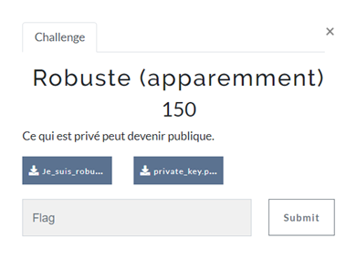
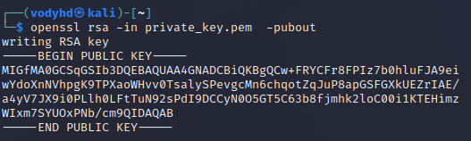
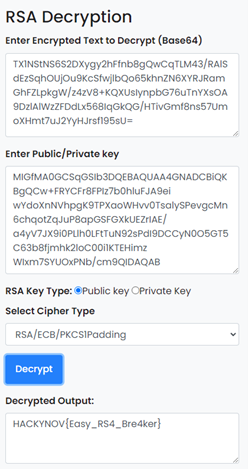

# ROBUSTE (APPAREMMENT)

| Nom du challenge  | Catégorie     | Nombre de points | Nombre de résolution |
|-------------------|---------------|------------------|----------------------|
| Robuste           | Cryptanalyse  |        150       |         6/11         |



On comprend que le message a été chiffré avec la clé privée. Le but est donc de retrouver la clé publique pour décoder le message.<br/>
Pour cela on peut utiliser OpenSSL :
```
openssl rsa -in private_key.pem -pubout
```



> -----BEGIN PUBLIC KEY-----
> MIGfMA0GCSqGSIb3DQEBAQUAA4GNADCBiQKBgQCw+FRYCFr8FPIz7b0hluFJA9ei
> wYdoXnNVhpgK9TPXaoWHvv0TsalySPevgcMn6chqotZqJuP8apGSFGXkUEZrIAE/
> a4yV7JX9i0PLlh0LFtTuN92sPdI9DCCyN0O5GT5C63b8fjmhk2loC00i1KTEHimz
> WIxm7SYUOxPNb/cm9QIDAQAB
> -----END PUBLIC KEY-----

Décodeur online : https://www.devglan.com/online-tools/rsa-encryption-decryption



FLAG : **HACKYNOV{Easy_RS4_Bre4ker}**
