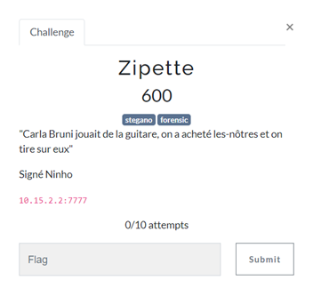
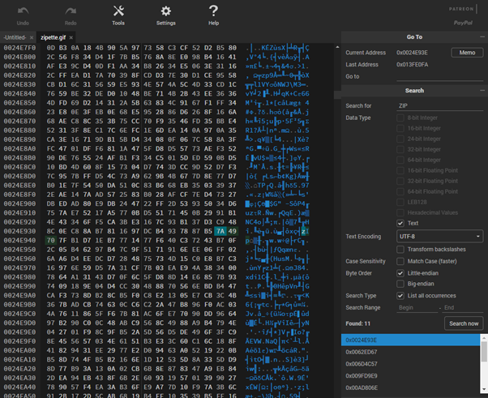
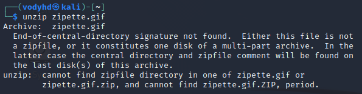
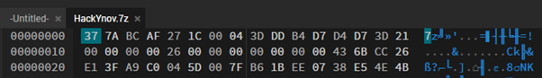
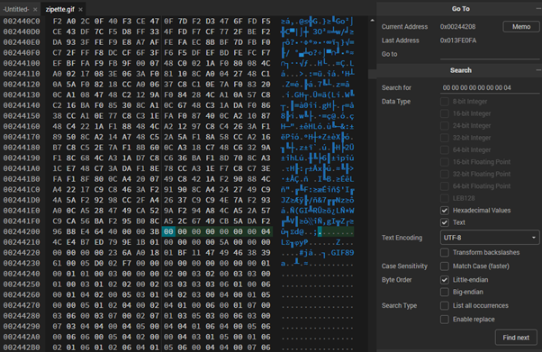
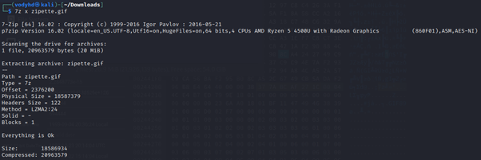

# ZIPETTE

| Nom du challenge  | Catégorie     | Nombre de points | Nombre de résolution |
|-------------------|---------------|------------------|----------------------|
| Zipette           | Miscellaneous |        600       |         1/11         |

Zipette évoque forcément le format ZIP. Il faut croire que ce challenge porte bien son nom. 
En regardant plus en profondeur dans le GIF, on trouve 11 occurrences au mot « ZIP ».

On essaie donc de l’extraire.

Après quelques recherches on voit que c’est possible de cacher un ZIP dans un GIF sans forcément que l’extension soit .zip. 
On se concentre donc sur la partie de l’erreur nous indiquant « End-of-central-directory signature not found ». Ce qui fait référence également à la description « Signé Ninho »

On en déduit donc que le fichier ZIP caché à l’intérieur du GIF a une signature corrompue. 
Après quelques recherches on voit qu’il y a plusieurs signatures pour des ZIP normaux, mais qu’une seule pour les 7zip. 
Si l’on regarde les 11 occurrences lors de notre ctrl-F, la majorité d’entre elles sont égalent à « 7A ». On peut donc en conclure que c’est un 7zip.

La signature pour ce format est : **37 7A BC AF 27 1C**

Prenons un exemple d’un 7zip, la signature est accompagnée de 2 octets supplémentaires qui ne changent jamais : **00 04**

Ce qui nous fait donc 6 octets à trouver et à rectifier.
On cherche donc **00 00 00 00 00 00** 00 04 et on remplace ça par la signature

Après l’avoir exporté, on peut enfin extraire les fichiers du 7zip.

Il n’y a plus qu’à ouvrir *flag.gif*

FLAG : **HACKYNOV{Stegano_mais_pas_que}**